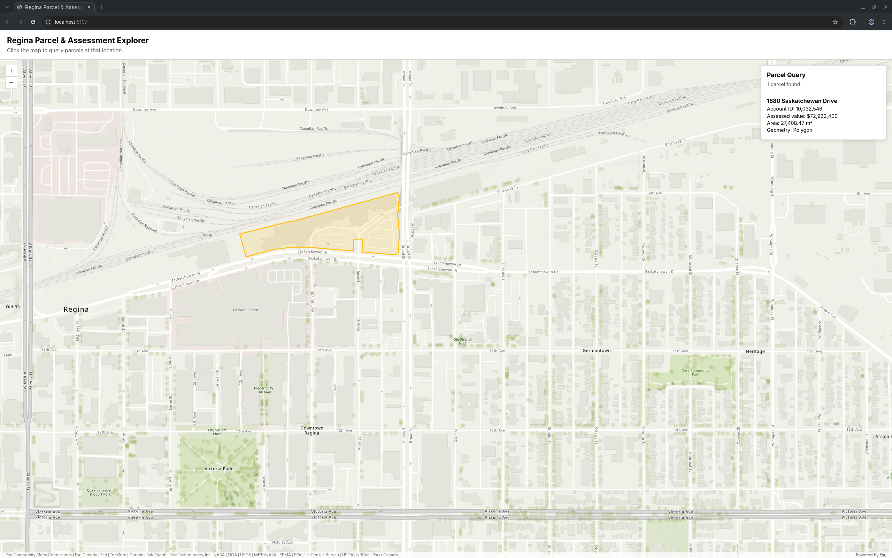

# Regina Parcel Explorer

A web app and data pipeline for exploring City of Regina property parcels. Click the map to see the parcel at that location: its address, tax account ID, assessed value and area, with its boundary highlighted. A Python ETL pipeline loads the City's open parcel data into SQL Server spatial tables, and an ASP.NET Core API serves it to a map built with the ArcGIS Maps SDK for JavaScript. Built as a portfolio project.



## Features

- Click-to-query map that highlights the parcel boundary and shows its details.
- REST API for point lookups and lookups by City object ID, with an OpenAPI document in Development.
- Repeatable ETL: extract, validate, then load, with every run recorded in the database.
- Data validation at two stages: the downloaded extract and the loaded table.

## Technology

| Layer | Technology |
|---|---|
| ETL | Python, `requests`, `shapely`, `mssql-python`, managed with [uv](https://docs.astral.sh/uv/) |
| Database | SQL Server spatial (`geometry`) with a spatial index |
| API | C#, ASP.NET Core (.NET 10), NetTopologySuite, ProjNET |
| Post-load validator | VB.NET console application |
| Front end | JavaScript, ArcGIS Maps SDK for JavaScript, GeoJSON |

## How it works

| Stage | Component | Reads | Writes |
|---|---|---|---|
| Extract | `etl/extract_parcels.py` | City of Regina ArcGIS REST service | `data/raw/regina_taxweb_parcels.json` |
| Validate (pre-load) | `etl/validate_parcels.py` | raw extract | `artifacts/parcel-validation-report.json` |
| Load | `etl/load_parcels.py` | raw extract | `dbo.Parcel`, `dbo.EtlRun` |
| Validate (post-load) | `validation/ReginaParcelValidator` | SQL Server | console output and exit code |
| Serve | `src/ReginaParcelExplorer.Api` | SQL Server | JSON API and static web app |

## Requirements

- [uv](https://docs.astral.sh/uv/) and Python 3.13 or newer
- .NET 10 SDK
- SQL Server 2017 or later with `geometry` support, and `sqlcmd` or SSMS to run the scripts in `sql/`
- Internet access (the City's data service, and the Esri-hosted map SDK and basemap)
- A bash or zsh shell for the commands below

## Getting started

1. Install the Python dependencies:

   ```bash
   uv sync
   ```

2. Create the database, tables and spatial index:

   ```bash
   sqlcmd -S localhost,1433 -U <admin login> -C -i sql/01_schema.sql
   sqlcmd -S localhost,1433 -U <admin login> -C -i sql/02_spatial_index.sql
   ```

   `GO` is a batch separator that `sqlcmd` and SSMS understand, so use one of them. `sqlcmd` reads the password from the `SQLCMDPASSWORD` environment variable or prompts for it, and `-C` trusts the server certificate (local development). The database name `ReginaParcelExplorer` is fixed in the scripts and must match `SQL_DATABASE`.

3. Configure the ETL and validator, then edit `.env` and set the `SQL_*` values:

   ```bash
   cp .env.example .env
   ```

4. Download, validate and load the data. The validator exits non-zero on `FAIL`, which stops the chain:

   ```bash
   uv run python etl/extract_parcels.py
   uv run python etl/validate_parcels.py && uv run python etl/load_parcels.py
   ```

5. Configure the API connection string with user secrets:

   ```bash
   dotnet user-secrets set "ConnectionStrings:ReginaParcelExplorer" "<connection string>" --project src/ReginaParcelExplorer.Api
   ```

   User secrets load only in the Development environment. In any other environment, set the `ConnectionStrings__ReginaParcelExplorer` environment variable instead. The API stops at startup with a clear message if the connection string is missing.

6. Start the API and web app, then open <http://localhost:5107>:

   ```bash
   dotnet run --project src/ReginaParcelExplorer.Api
   ```

   The `https` launch profile serves on port 7006 and needs a trusted development certificate (`dotnet dev-certs https --trust`).

## Validating the loaded data

The VB.NET validator checks the loaded table independently of the Python code, including that it matches the latest successful ETL run. .NET does not read `.env`, so export it into the shell first:

```bash
set -a; source .env; set +a
dotnet run --project validation/ReginaParcelValidator
```

Exit codes: `0` pass, `1` fail, `2` configuration or SQL error.

## Configuration

| Setting | Used by | Where |
|---|---|---|
| `SQL_SERVER`, `SQL_DATABASE`, `SQL_USER`, `SQL_PASSWORD` | ETL loader, VB.NET validator | `.env` |
| `SQL_TRUST_SERVER_CERTIFICATE` (`yes` or `no`, default `no`) | ETL loader, VB.NET validator | `.env` |
| `ConnectionStrings:ReginaParcelExplorer` | API | user secrets or environment variable |

`SQL_TRUST_SERVER_CERTIFICATE=yes` accepts a self-signed certificate and is for local development only.

## API

| Endpoint | Description |
|---|---|
| `GET /api/parcels/at-point?longitude=&latitude=` | Parcels intersecting a WGS84 point. Returns `[]` when the point is not inside a parcel. |
| `GET /api/parcels/{sourceObjectId}` | One parcel by City of Regina object ID, with its centroid. Returns `404` if not found. |

Responses include `sourceObjectId`, `tasAcctId`, `fullAddress`, `assessedValue`, `multiAccts` and `areaSquareMeters`. The at-point response adds a GeoJSON `geometry` in WGS84, and the by-id response adds `centroidLongitude` and `centroidLatitude`. Invalid input returns `400` with a ProblemDetails body. In Development, the OpenAPI document is served at `/openapi/v1.json`.

`areaSquareMeters` is computed from the projected geometry (EPSG:26913), so it is a grid area and can differ slightly from the legal lot area. A centroid can fall outside an irregular parcel.

## Tests

`tests/api_smoke_test.py` is a dependency-free smoke test of the API. Start the API with the database loaded, then run:

```bash
uv run python tests/api_smoke_test.py
```

Set `API_BASE_URL` to test a different address. The known-parcel constants in the file refer to the reference extract; update them if the City republishes the data with different object IDs. The test is run manually and is not part of a CI pipeline.

## Project layout

```text
src/ReginaParcelExplorer.Api/       ASP.NET Core API and static front end (wwwroot)
etl/                                extract, validate and load scripts
validation/ReginaParcelValidator/   post-load SQL Server validator (VB.NET)
sql/                                schema, spatial index and example queries
tests/                              API smoke test
docs/                               screenshot and sample validation report
ReginaParcelExplorer.slnx           .NET solution
```

## Design notes

- **Independent ETL scripts.** Each stage reads the previous stage's output file and shares no code, so any stage can be run and debugged alone. The extract file's schema is documented in the docstring of `etl/extract_parcels.py`.
- **Spatial reference contract.** The extract requests EPSG:26913 explicitly and records the spatial reference the service reports. The validator and loader each verify it before processing.
- **Safe writes.** Output files are written to a temporary file and atomically renamed, so a failed run never leaves a half-written file.
- **Full-refresh load.** The loader bulk-copies into a staging table, then truncates and repopulates `dbo.Parcel`. The refresh, the row-count and geometry-validity checks and the run record commit in a single transaction. A failed or interrupted run rolls back and is recorded as `Failed` on a separate connection.
- **Stable public identifier.** `SourceObjectId` (the City's OBJECTID) is unique and is the identifier the API exposes. `ParcelId` is an internal key that the load's `TRUNCATE` resets, so it is never exposed.
- **Rules in the database.** A unique `SourceObjectId`, a positive account ID and a required SRID are enforced by the schema, not only by the ETL.

## Data quality

The reference run extracted 86,750 records and loaded 86,719. The 31 excluded records have no tax account (`TAS_ACCT_ID = 0`) and no address or assessment. One account ID appears on two parcels; both are kept, so `TasAcctId` is not unique. The validation status for this data is `PASS_WITH_WARNINGS`; see [`docs/sample-validation-report.json`](docs/sample-validation-report.json). The sample is one recorded run and may not reflect later changes to the source service.

The Python validator's geometry checks are structural (closed rings, finite coordinates). Topological validity is enforced by the loader and confirmed in SQL Server with `STIsValid()`.

## Limitations and security

- The parcel data is a snapshot; refresh it by re-running the ETL. It depends on the City's service being available.
- The map is queried by clicking, so the lookup is pointer-driven.
- The project has no authentication and is intended for local use. Do not expose the SQL Server port to a network.
- Do not run the application as `sa` outside local experiments. Create a dedicated SQL login: the API needs read access to `dbo.Parcel`, and the ETL needs to insert into `dbo.Parcel` and `dbo.EtlRun` and `ALTER` `dbo.Parcel` (required by `TRUNCATE`).
- `.env`, user secrets and the `data/` directory are git-ignored. `AllowedHosts` is `*` (the template default); restrict it before any deployment.

Questions and bug reports are welcome in this repository's Issues.

## Data source and attribution

Parcel data comes from the City of Regina TaxWeb ArcGIS layer: <https://opengis.regina.ca/arcgis/rest/services/CGISViewer/Taxweb/MapServer/0>

Contains information licensed under the Open Government Licence – City of Regina. See the [licence](https://www.regina.ca/city-government/open-data/open-government-licence/). This project is not endorsed by or affiliated with the City of Regina.

The data is not redistributed in this repository. The pipeline downloads it at run time into `data/`, which is git-ignored. The map uses an Esri-hosted basemap and SDK and is subject to Esri's terms; basemap attribution is displayed by the map.

## License

Code is released under the [MIT License](LICENSE). The parcel data is licensed separately under the City of Regina Open Government Licence (see above).
